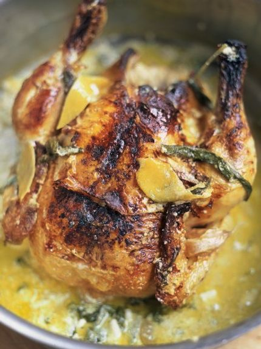

Chicken in Milk

`SERVES 4COOKS IN1 HOUR 40 MINUTESDIFFICULTYSUPER EASY`

## Ingredients

 * 1 x 1.5 kg free-range whole chicken
 * 100 g unsalted butter
 * olive oil
 * ½ a cinnamon stick
 * 1 bunch of fresh sage , leaves picked
 * 2 lemons
 * 10 cloves of garlic
 * 550 ml milk

## instructions

1. Preheat the oven to 190ºC/375ºF/gas 5, and find a snug-fitting pot for the chicken.

2. Season the chicken generously with sea salt and black pepper, and fry it in the butter and a little oil, turning regularly to get an even colour all over.

3. Remove from the heat, put the chicken on a plate, and throw away the oil and butter left in the pot. This will leave you with tasty sticky goodness at the bottom of the pan which will give you a lovely caramelly flavour later on.

4. Put the chicken back in the pot with the rest of the ingredients (speed-peel the lemon zest and leave the garlic cloves unpeeled), and cook in the preheated oven for 1 hour 30 minutes, basting with the cooking juice when you remember. The lemon zest will sort of split the milk, making a sauce which is absolutely fantastic.

5. To serve, pull the meat off the bones and divide between plates. Spoon over plenty of juice and the little curds. Delicious served with wilted spinach or greens and some mashed potato.

Ref: https://www.jamieoliver.com/recipes/chicken-recipes/chicken-in-milk