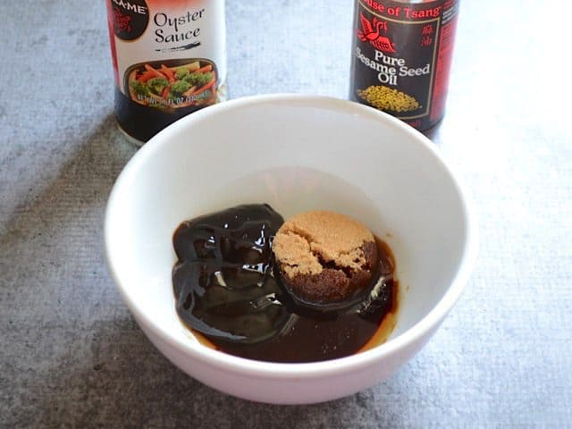
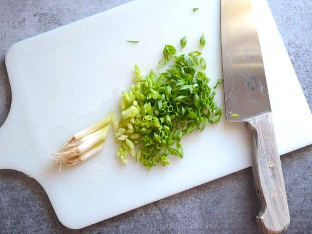
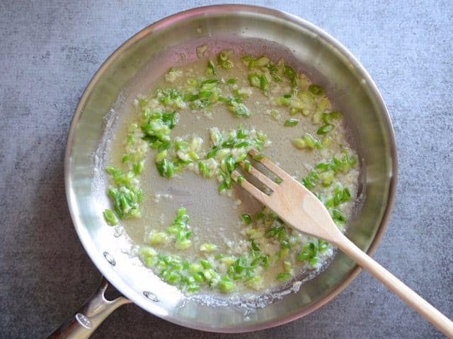
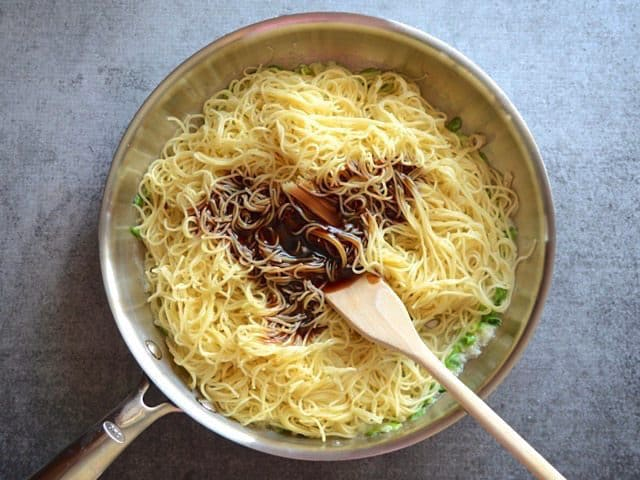
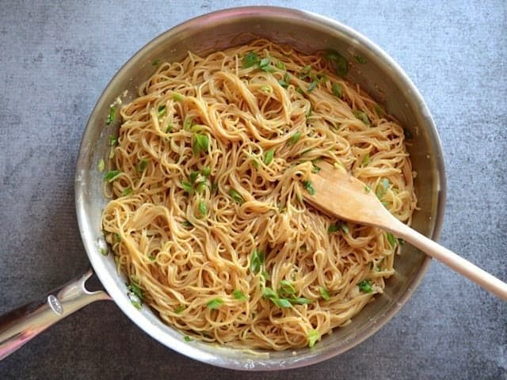
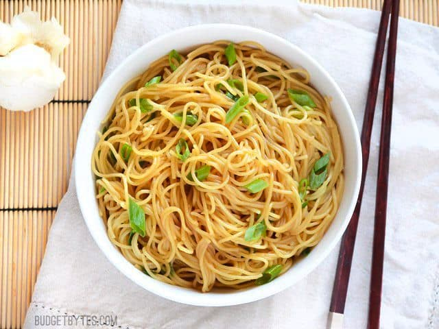

Garlic noodles

# GARLIC NOODLES

## WHERE DO I FIND OYSTER SAUCE?
Oyster sauce can be found in the International aisle of most major grocery stores (look near hoisin sauce). If you can’t find it there, it’s worth it to seek out an Asian market, where oyster sauce is likely to be much less expensive than chain grocery stores.

## WHAT CAN I USE IN PLACE OF OYSTER SAUCE?
I personally feel that the salty rich flavor of the oyster sauce makes this dish and I wouldn’t suggest substituting it. That being said, several readers have said that they’ve used hoisin sauce, which is much sweeter, and have enjoyed the results. Substitute at your own risk. 

Prep Time: 10 mins
Cook Time: 15 mins
Total Time: 25 mins

## INGREDIENTS

 - 8 oz angel hair pasta ($0.54)
 - 4 cloves garlic ($0.24)
 - 1/2 bunch green onions ($0.35)
 - 4 Tbsp butter ($0.50)
 - 2 tsp soy sauce ($0.20)
 - 2 Tbsp brown sugar ($0.05)
 - 1 tsp sesame oil ($0.40)
 - 2 Tbsp oyster sauce ($0.26)

 
## INSTRUCTIONS

1. Add the oyster sauce, brown sugar, soy sauce and sesame oil to a bowl and stir until combined.
2. Bring a large pot of water to a boil and cook the noodles according to the package directions (boil for 7-10 minutes). Drain the cooked noodles in a colander, then set aside.
3. While the pasta cooks, mince the garlic and slice the green onions. Melt the butter in a large skillet over medium-low heat. Once the butter is melted and bubbly, add the garlic and onions (save a few for garnish) and sauté until they are soft and fragrant (1-2 minutes).
4. Remove the skillet from the heat. Add the drained pasta and oyster sauce mixture to the skillet, and stir well to coat the pasta. If your pasta is stiff or sticky making it hard to stir, sprinkle a small amount of hot water over the pasta to loosen it up. Garnish the pasta with any reserved sliced green onions, then serve.

## HOW TO MAKE GARLIC NOODLES – STEP BY STEP PHOTOS

### Mix Sauce ingredients in a bowl
Mix the sauce before you begin. In a small bowl stir together 2 Tbsp oyster sauce, 2 Tbsp brown sugar, 2 tsp soy sauce, and 1 tsp toasted sesame oil. Stir until combined. 

### Slice Green Onions
Bring a large pot of water to a boil and cook the pasta according to the package directions. Drain and set aside. While the pasta is cooking, mince four cloves of garlic and slice about four green onions (1/2 bunch).

### Sauté Garlic and Green Onions
Heat 4 Tbsp of butter in a large skillet over medium-low heat. Once melted, add the minced garlic and most of the sliced green onions (save a few for garnish). Sauté the garlic and green onions until soft and fragrant (1-2 minutes).

### Add Noodles and Sauce to skillet
Remove the skillet from the heat, then add the cooked and drained pasta, and the prepared sauce.

### Mix Pasta and Sauce and top with green onion
Toss the ingredients in the skillet until the pasta is evenly coated with sauce. Garnish with the reserved green onions and serve.

Overhead view of Garlic Noodles in a bowl

