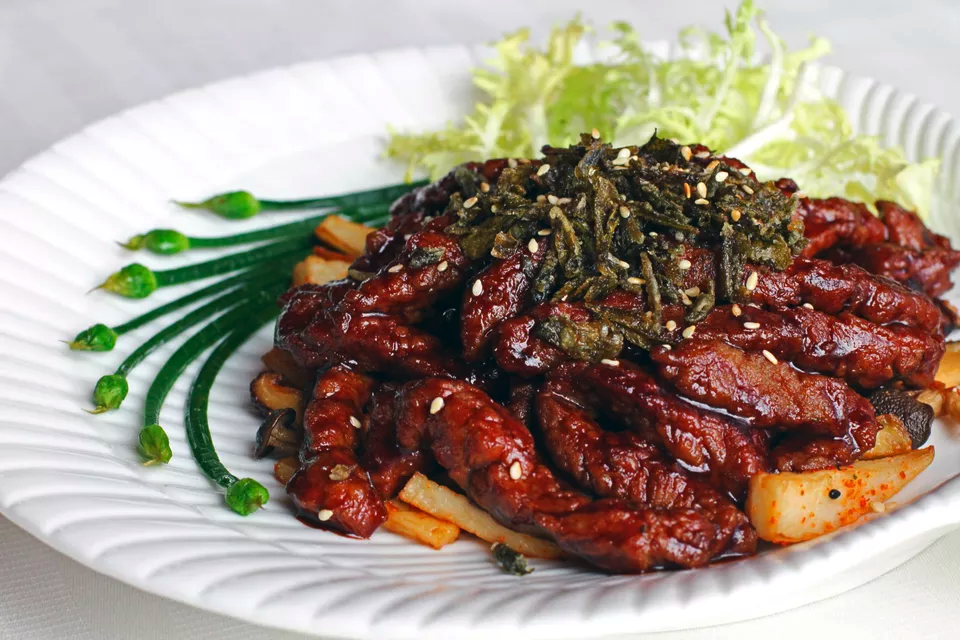

Honey Beef With Toasted Sesame Seeds

# Honey Beef With Toasted Sesame Seeds

Beef is marinated in a honey and soy mixture, stir-fried with oyster sauce and topped with sesame seeds. If desired, toast the sesame seeds before serving.

`Serves 2 to 4`

## Ingredients
 * 1/2 pound flank steak
 * 1/2 red bell pepper
 * 1/2 green bell pepper
 * 1 cup mung bean sprouts
 * 1 stalk celery
 
### Marinade:
 * 4 teaspoons liquid honey
 * 3 tablespoons soy sauce
 * 1 tablespoon water
 * 1 green onion (chopped)
 * 2 teaspoons cornstarch

### Sauce:
 * 1 tablespoon oyster sauce
 * 1/4 cup low-sodium chicken broth
 * 1 teaspoon granulated sugar
 
### Other:
 * 1 clove garlic
 * 2 slices ginger
 * 1 teaspoon cornstarch mixed with 4 teaspoons water
 * 3 tablespoons white sesame seeds (toasted)
 * 4 tablespoons oil for stir-frying

## Instructions

1. Wash and drain the vegetables. Remove the stems and seeds from the bell peppers and cut them into thin strips. Rinse and thoroughly drain the mung bean sprouts. String the celery and cut on the diagonal into thin strips.
2. Cut the flank steak across the grain into thin strips. Combine with the marinade ingredients, adding the cornstarch last.
3. Marinate the steak for 15 minutes.
4. Combine the sauce ingredients and set aside.
5. Heat the wok over medium-high heat. Add 2 tablespoons oil to the heated wok.
6. When the oil is ready, add the beef. Brown briefly, then stir-fry until nearly cooked through. Remove from the wok.
7. Clean out the wok if necessary.
8. Add 2 tablespoons oil.
9. Add the garlic and ginger and stir-fry briefly until fragrant (about 30 seconds).
10. Add the green pepper and the celery. Stir-fry briefly, and add the red pepper.
11. Push the vegetables up to the sides of the wok.
12. Add the sauce in the middle of the wok. Heat briefly, then add the cornstarch and water slurry, stirring to thicken.
13. Add the steak back into the wok.
14. Add the mung bean sprouts.
15. Mix everything together.
16. Sprinkle with the sesame seeds before serving.

Ref https://www.thespruceeats.com/honey-beef-with-sesame-seeds-recipe-694114
