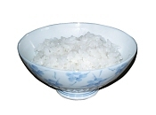
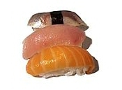
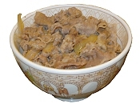
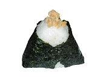
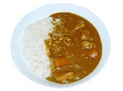
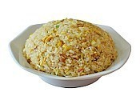

Japanese dishes

# Popular Dishes

The [Japanese cuisine](https://www.japan-guide.com/e/e620.html) offers a great variety of dishes and regional specialties. Some of the most popular Japanese dishes are listed below. They are categorized below into [rice dishes](https://www.japan-guide.com/e/e2035.html#rice), [seafood dishes](https://www.japan-guide.com/e/e2035.html#sea), [noodle dishes](https://www.japan-guide.com/e/e2035.html#noodle), [nabe dishes](https://www.japan-guide.com/e/e2035.html#nabe), [meat dishes](https://www.japan-guide.com/e/e2035.html#meat), [soybean dishes](https://www.japan-guide.com/e/e2035.html#soy), [yoshoku dishes](https://www.japan-guide.com/e/e2035.html#yoshoku) and [other dishes](https://www.japan-guide.com/e/e2035.html#other). Please note that some dishes may fit into multiple categories, but are listed only once.

### Rice Dishes

For over 2000 years, [rice](https://www.japan-guide.com/e/e2043.html) has been the most important food in Japanese cuisine. Despite changes in eating patterns over the last few decades and slowly decreasing rice consumption in recent years, [rice](https://www.japan-guide.com/e/e2043.html) remains one of the most important ingredients in Japan today.

# Rice Bowl

A bowl of plain, cooked rice is served with most Japanese meals. For breakfast, it is sometimes mixed with a raw egg and [soy sauce](https://www.japan-guide.com/e/e2045.html) (tamago-kake gohan) or enjoyed with [natto](https://www.japan-guide.com/e/e2045.html) or other toppings.

[(L)](https://www.japan-guide.com/e/e2038.html)

[(L)](https://www.japan-guide.com/e/e2038.html)

# Sushi

[Sushi](https://www.japan-guide.com/e/e2038.html) is a dish containing sushi rice, cooked, white rice, flavored with seasoned rice vinegar. There are various kinds of sushi dishes, such as nigirizushi (hand formed sushi), makizushi (rolled sushi), and chirashi (sushi rice topped with raw fish). Sushi is the most famous Japanese dish outside of Japan, and one of the most popular dishes inside Japan, as well.

[(L)](https://www.japan-guide.com/e/e2342.html)

[(L)](https://www.japan-guide.com/e/e2342.html)

# Donburi

[Donburi](https://www.japan-guide.com/e/e2342.html) refers to a bowl of plain, cooked rice with some other food on top of it. Donburi are served at specialty restaurants, but they are also common at many other types of restaurants. Some of the most popular varieties are [gyudon](https://www.japan-guide.com/e/e2345.html) (stewed beef), katsudon ([tonkatsu](https://www.japan-guide.com/e/e2339.html)), tendon ([tempura](https://www.japan-guide.com/r/e106.html)), oyakodon (chicken and egg), tekkadon (maguro) and kaisendon (raw seafood).

# Rice Balls (Onigiri)

Rice balls (onigiri) are made of cooked rice and are typically wrapped in nori [seaweed](https://www.japan-guide.com/e/e2310.html). They are usually lightly seasoned with salt and often contain a filling such as [umeboshi](https://www.japan-guide.com/e/e2349.html#umeboshi) (pickled Japanese plum), okaka (dried bonito shavings and konbu) or salmon. Rice balls are a popular and inexpensive, portable snack, homemade or available at [convenience stores](https://www.japan-guide.com/e/e2071.html), but are also commonly served at [general restaurants](https://www.japan-guide.com/e/e2036.html) and [izakaya](https://www.japan-guide.com/e/e2036_izakaya.html).

[(L)](https://www.japan-guide.com/e/e2351.html)

[(L)](https://www.japan-guide.com/e/e2351.html)

# Kare Raisu (Curry Rice)

[Kare Raisu](https://www.japan-guide.com/e/e2351.html) is cooked rice with a Japanese curry sauce. It can be served with additional toppings such as [tonkatsu](https://www.japan-guide.com/e/e2339.html). Curry is not a native Japanese spice, but has been used in Japan for over a century. Kare Raisu is a very popular dish, and many inexpensive Kare Raisu [restaurants](https://www.japan-guide.com/e/e2036.html) can be found especially in and around [train stations](https://www.japan-guide.com/e/e2019.html).

# Fried Rice (Chahan)

Fried rice, or chahan, is a dish that was originally introduced from China. There are an infinite variety of ingredients that can be added to fried rice. Some common ones are peas, egg, green onions (negi), carrots and pork. Chahan is a suitable dish for using left over rice.

# Chazuke (Ochazuke)

Chazuke, or ochazuke, is another simple comfort food consisting of [tea](https://www.japan-guide.com/e/e2041.html) or light fish stock poured over rice (sometimes made with leftover rice). Chazuke is often garnished with toppings such as [umeboshi](https://www.japan-guide.com/e/e2349.html#umeboshi), grilled salmon or [pickles](https://www.japan-guide.com/e/e2349.html). Chazuke is commonly served at [izakaya](https://www.japan-guide.com/e/e2036_izakaya.html) and is a popular dish to eat after drinking.

# Kayu

Kayu, or okayu, is Japanese rice porridge made by slow cooking rice in lots of water. It tends to be thicker than other types of rice porridge or gruel, and is a suitable dish for using left over rice. Kayu is often garnished with [umeboshi](https://www.japan-guide.com/e/e2349.html#umeboshi) and is commonly served to sick people because it is easily digestible.

### Seafood Dishes

Hundreds of different fish, shellfish and other seafood from the oceans, seas, lakes and rivers are used in the Japanese cuisine. They are prepared and eaten in many different ways, such as raw, dried, boiled, grilled, deep fried or steamed.

[(L)](https://www.japan-guide.com/e/e2044.html)

[(L)](https://www.japan-guide.com/e/e2044.html)

# Sashimi

[Sashimi](https://www.japan-guide.com/e/e2044.html) is raw seafood. A large number of fish can be enjoyed raw if they are fresh and prepared correctly. Most types of sashimi are enjoyed with [soy sauce](https://www.japan-guide.com/e/e2045.html) and [wasabi](https://www.japan-guide.com/e/e2311.html).

# Yakizakana

Yakizakana means grilled fish. Many varieties of fish are enjoyed in this way, including mackerel (saba), salmon (sake), mackerel pike (sanma), horse mackerel (aji), Okhotsk atka mackerel (hokke), sea bream (tai) and sweetfish (ayu).

### Noodle Dishes

There are various traditional Japanese noodle dishes as well as some dishes which were introduced to Japan and subsequently Japanized. Noodle dishes are very popular in Japan and are served both hot and cold depending on the season. Noodle restaurants and food stands are ubiquitous, and it is common to find noodle stands along train platforms.

[(L)](https://www.japan-guide.com/r/e104.html)

[(L)](https://www.japan-guide.com/r/e104.html)

# Soba

[Soba](https://www.japan-guide.com/r/e104.html) are native Japanese noodles made of buckwheat flour or a mixture of buckwheat and wheat flour. Soba are about as thick as spaghetti, and are served either hot or cold and with various toppings.

[(L)](https://www.japan-guide.com/r/e105.html)

[(L)](https://www.japan-guide.com/r/e105.html)

# Udon

[Udon](https://www.japan-guide.com/r/e105.html) are Japanese noodles made of wheat flour. Udon are thicker than soba and are also served either hot or cold and with various toppings such as [fried tofu](https://www.japan-guide.com/e/e2045_tofu.html) (kitsune udon), [tempura](https://www.japan-guide.com/e/e2035.html#tempura) (tempura udon) and mountain vegetables (sansai udon).

[(L)](https://www.japan-guide.com/e/e2042.html)

[(L)](https://www.japan-guide.com/e/e2042.html)

# Ramen

[Ramen](https://www.japan-guide.com/e/e2042.html) is Chinese style noodles prepared in a soup with various toppings. Ramen is one of the many popular dishes that were originally introduced from China but have become completely Japanized over time.

# Somen

Like Udon noodles, somen are Japanese noodles made of wheat flour, but they are much thinner than udon and soba. Somen are usually eaten cold and are considered a summer speciality.

# Yakisoba

Yakisoba are grilled or fried Chinese style noodles mixed with pieces of meat, cabbage, carrots or other [vegetables](https://www.japan-guide.com/e/e2346.html), and garnished with red ginger. It is a popular [festival](https://www.japan-guide.com/e/e2063.html) food.

### Nabe Dishes

Nabe, or hot pot dishes, are prepared in a hot pot, usually at the table. Typical ingredients are [vegetables](https://www.japan-guide.com/e/e2346.html) such as negi (Japanese leek) and hakusai (Chinese cabbage), various [mushrooms](https://www.japan-guide.com/e/e2340.html), seafood and/or meat. There are many regional and personal varieties, and they are especially popular in the cold winter months. Some special nabe dishes are:

# Oden

A nabe dish prepared with various fish cakes, [daikon](https://www.japan-guide.com/e/e2346.html), boiled eggs, konyaku and [kombu seaweed](https://www.japan-guide.com/e/e2310.html), slow simmered in a [soy sauce](https://www.japan-guide.com/e/e2045.html) based soup. Oden is a popular dish available at [convenience stores](https://www.japan-guide.com/e/e2071.html) in the winter.

# Sukiyaki

A nabe dish prepared with thinly sliced meat, [vegetables](https://www.japan-guide.com/e/e2346.html), [mushrooms](https://www.japan-guide.com/e/e2340.html), [tofu](https://www.japan-guide.com/e/e2045_tofu.html) and shirataki (konyaku noodles) simmered in a sweet [soy sauce](https://www.japan-guide.com/e/e2045.html) broth. The pieces of food are dipped into raw beaten egg before being eaten.

# Shabu Shabu

Shabu shabu is a Japanese style hot pot in which pieces of thinly sliced meat, seafood, [vegetables](https://www.japan-guide.com/e/e2346.html), [mushrooms](https://www.japan-guide.com/e/e2340.html) and [tofu](https://www.japan-guide.com/e/e2045_tofu.html) are cooked by dipping them into a hot soup. The bite-sized pieces are then dipped into a ponzu citrus or sesame sauce before being eaten.

# Chanko Nabe

Chanko nabe is the traditional staple diet of [sumo wrestlers](https://www.japan-guide.com/e/e2080.html). There are many varieties of chanko nabe, which can be tried at one of the several specialty chanko nabe [restaurants](https://www.japan-guide.com/e/e2036.html) found around [Ryogoku](https://www.japan-guide.com/e/e3022.html), the sumo district in [Tokyo](https://www.japan-guide.com/e/e2164.html).

### Meat Dishes

Meat has been eaten in Japan in larger amounts only since the second half of the 19th century. Nowadays there are a variety of popular Japanese meat dishes.

[(L)](https://www.japan-guide.com/r/e102.html)

[(L)](https://www.japan-guide.com/r/e102.html)

# Yakitori

[Yakitori](https://www.japan-guide.com/r/e102.html) are skewered grilled chicken pieces seasoned with salt or sauce. Almost every part of the chicken is used for yakitori including the white and dark meat, gizzards, skin and other organs.

[(L)](https://www.japan-guide.com/e/e2339.html)

[(L)](https://www.japan-guide.com/e/e2339.html)

# Tonkatsu

[Tonkatsu](https://www.japan-guide.com/e/e2339.html) are deep fried pork cutlets. Tonkatsu is usually served accompanied by shredded cabbage or on top of cooked rice ([katsudon](https://www.japan-guide.com/e/e2342.html)). It is also a common addition to Japanese style [curry rice](https://www.japan-guide.com/e/e2351.html) (katsu kare).

# Yakiniku

Yakiniku literally means "grilled meat" and refers to grilling bite-size pieces of meat - mostly beef and pork - on a grill at the table. Specialized yakiniku restaurants are among the most popular [restaurant types](https://www.japan-guide.com/e/e2036.html) in Japan and usually serve a wide variety of meat parts at multiple quality (and cost) levels.

# Nikujaga

Nikujaga is a popular dish of home style cooking made of sweet stewed meat (niku) and [potatoes](https://www.japan-guide.com/e/e2346.html) (jagaimo).

# Teppanyaki

Meat, seafood and [vegetables](https://www.japan-guide.com/e/e2346.html) are prepared on a large iron griddle (teppan) around which the diners are seated. The chef artfully prepares the dishes in front of his or her customers.

### Soybean Dishes

[Tofu](https://www.japan-guide.com/e/e2045_tofu.html), natto, miso and many other important ingredients of Japanese cooking are made of [soybeans](https://www.japan-guide.com/e/e2045.html). The following are some of the most popular soybean based dishes:

# Miso Soup

Miso soup is made by dissolving miso paste in fish stock (dashi). Common additions include [wakame seaweed](https://www.japan-guide.com/e/e2310.html), small pieces of tofu, and sliced [aburaage](https://www.japan-guide.com/e/e2045_tofu.html#aburaage), etc. A bowl of miso soup is part of most traditional Japanese meals.

# Hiyayakko

Hiyayakko is fresh, chilled [tofu](https://www.japan-guide.com/e/e2045_tofu.html) (usually soft tofu) commonly garnished with grated ginger, katsuobushi (shaved bonito flakes) and green onions. Diners should pour a little soy sauce over the tofu before eating it if it did not come already seasoned.

# Yudofu

Yudofu are tofu pieces boiled in a clear, mild soup and dipped into soy sauce or ponzu (citrus sauce) before being eaten. Yudofu is a specialty of [Kyoto](https://www.japan-guide.com/e/e2158.html) and commonly served during the colder winter months.

# Agedashidofu

Agedashidofu is made of lightly breaded tofu which is fried and served hot in a dashi soy sauce broth and commonly garnished with green onions or grated daikon. Agedashidofu can be found in a variety of restaurants and is common [izakaya](https://www.japan-guide.com/e/e2036_izakaya.html) food.

### Yoshoku Dishes

A large number of Western dishes have been introduced to Japan over the centuries. Many of them have become completely Japanized and are referred to as Yoshoku dishes. Some of the most popular ones are:

[(L)](https://www.japan-guide.com/r/e101.html)

[(L)](https://www.japan-guide.com/r/e101.html)

# Korokke

[Korokke](https://www.japan-guide.com/r/e101.html) has its origins in the croquettes which were introduced to Japan in the 19th century. Korokke consist of a filling that is breaded and deep fried, and are eaten with a Worcestershire tonkatsu sauce and shredded cabbage. They come in many varieties depending on the filling, the most common of which is a mix of minced meat and mashed potatoes.

# Omuraisu

Omuraisu, short for omelete rice, is fried rice wrapped in a thin egg omelete. Omuraisu is usually shaped like an American football and may be garnished with ketchup or demi-glace sauce. It is a common diner or cafe food, although specialty omuraisu restaurants also exist.

# Hayashi Raisu

Hayashi rice is Japanese style hashed beef stew, thinly sliced beef and onions in a demi-glace sauce served over or alongside cooked rice. It resembles [kare raisu](https://www.japan-guide.com/e/e2351.html), and, like kare raisu, is also eaten with a spoon.

# Hambagu

Hambagu is Japanese style hamburger steak (as opposed to hambaga, which are hamburgers in a bun). Hambagu is usually served on a plate alongside vegetables and rice or bread, and seasoned with a demi-glace sauce.

### Other Dishes

# Bento

Bento, or boxed meals, are inexpensive, single portion take-out meals served in a box. They usually consist of small portions of meat, vegetables, fish or pickles together with rice. Bento come in both hot and cold varieties and are sold at [specialty restaurants](https://www.japan-guide.com/e/e2036.html), [supermarkets](https://www.japan-guide.com/e/e2073.html) and [convenience stores](https://www.japan-guide.com/e/e2071.html). They are also a popular item at train stations (ekiben) and airports (soraben).

[(L)](https://www.japan-guide.com/r/e106.html)

[(L)](https://www.japan-guide.com/r/e106.html)

# Tempura

[Tempura](https://www.japan-guide.com/r/e106.html) consists of seafood, [vegetables](https://www.japan-guide.com/e/e2346.html), [mushrooms](https://www.japan-guide.com/e/e2340.html) or meat coated with batter and deep fried. The resulting food has a light but crispy texture that may be seasoned with salt or dipped in a light sauce before eating. Tempura was introduced to Japan by the Portuguese in the 16th century and has become one of Japan's most famous dishes internationally.

[(L)](https://www.japan-guide.com/r/e100.html)

[(L)](https://www.japan-guide.com/r/e100.html)

# Okonomiyaki

[Okonomiyaki](https://www.japan-guide.com/r/e100.html) is a type of grilled pancake into which various ingredients such as seafood, [vegetables](https://www.japan-guide.com/e/e2346.html) and meat are mixed. Some specialty restaurants have large hotplates built into the tables on which patrons can cook their own okonomiyaki.

# Monjayaki

Monjayaki is a [Kanto Region](https://www.japan-guide.com/list/e1103.html) specialty that is similar to [okonomiyaki](https://www.japan-guide.com/r/e100.html); however, the batter used is much thinner, resulting in a moister, less uniform dish. Monjayaki is often served at okonomiyaki restaurants.

[(L)](https://www.japan-guide.com/r/e107.html)

[(L)](https://www.japan-guide.com/r/e107.html)

# Gyoza

[Gyoza](https://www.japan-guide.com/r/e107.html) are dumplings stuffed with a filling made of minced [vegetables](https://www.japan-guide.com/e/e2346.html) and ground meat. Gyoza were introduced to Japan from China. Japanese gyoza are usually prepared by frying them, and they are commonly served as a side dish to [ramen](https://www.japan-guide.com/e/e2042.html).

# Chawanmushi

Chawanmushi is savory steamed egg custard that usually contains pieces of chicken, shrimp, fish cake and a ginko nut mixed inside. It is served in a small, lidded cup and eaten with a spoon.

[(L)](https://www.japan-guide.com/e/e2349.html)

[(L)](https://www.japan-guide.com/e/e2349.html)

# Pickles

Japanese [pickles](https://www.japan-guide.com/e/e2349.html), or tsukemono, come in many varieties and are served with practically all traditional Japanese meals.

[(L)](https://www.japan-guide.com/e/e2312.html)

[(L)](https://www.japan-guide.com/e/e2312.html)

# Sweets

[Traditional Japanese sweets](https://www.japan-guide.com/e/e2312.html) (wagashi) are typically enjoyed in combination with a cup of [green tea](https://www.japan-guide.com/e/e2041.html) and come in a wide variety of shapes, flavors and ingredients. The most common ingredient used is sweet azuki bean paste.

Advertisement

## External Links and Resources

### English

•[(L)](https://www.japan-guide.com/link.html?/e/e2035.html+english+nagomi+1+1+0+http://www.japan-guide.com/ad/nagomi/+)

#### Nagomi Visit

Meet locals all over Japan in their own home to eat and cook.

#

Bookyour trip

- Hotels
- Flights
- Car
- Buses
- Tours

With:

# Japan Travel News

[(L)](https://www.japan-guide.com/event/rugby2019/)

## Rugby World Cup 2019

Travel Guide

[(L)](https://www.japan-guide.com/link.html?/e/e2035.html+report+topstory+68+125+0+/blog/craft-beer/190701.html)

## Craft Beer Japan: Ueno

Craft Beer Japan

[(L)](https://www.japan-guide.com/link.html?/e/e2035.html+report+topstory+66+121+0+/chottozeitaku/190531.html)

## A day out in Karuizawa

Chotto Zeitaku Japan

[(L)](https://www.japan-guide.com/link.html?/e/e2035.html+report+topstory+64+118+0+/blog/recovery/190418.html)

## Eight years after the tsunami

Itinerary Ideas

[(L)](https://www.japan-guide.com/link.html?/e/e2035.html+report+topstory+65+119+0+/blog/a-stroll-through/190622.html)

## A Stroll Through Matsumoto

A Stroll Through Japan

[(L)](https://www.japan-guide.com/link.html?/e/e2035.html+report+topstory+63+115+0+/e/e2038.html)

## Sushi 101

Travel Guide

[(L)](https://www.japan-guide.com/link.html?/e/e2035.html+report+topstory+62+114+0+/blog/golf-in-japan/190426.html)

## Golfing 2 hours from Tokyo near Utsunomiya

Golf in Japan