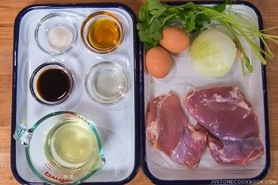

Oyakodon (Chiken and egg bowl)

# Oyakodon (Chiken and egg bowl)

`Serves 2`

Oyakodon is cooked in one pan where onions, chicken, and egg are simmered in an umami rich dashi-based sauce. It is then poured over a bowl of fluffy steamed rice. Simple, delicious, and utterly comforting, this is the kind of one-bowl meal you can cook in less than 30 minutes!

When it comes to mainstream fast food, Japan offers not only hamburgers and french fries, but the menu also extends to noodles and donburi (rice bowl) meals.

During lunchtime, you’d see diners and cafeterias around the office buildings crowded with Japanese salarymen and office ladies making their fuss-free fast food orders. These lunch spots usually serve up quick one-bowl meals, and Oyakodon (親子丼) or Oyako Donburi (親子丼ぶり) is often one of the popular choices.

## What is Oyakodon?
Classic soul food of Japan, the literal translation of Oyakodon (親子丼) means “parent-and-child rice bowl.” Chicken (as in parent), egg (as in child), and onions are simmered together in a dashi and soy sauce-based broth then served on top of steamed rice.

Similar to Gyudon and Katsudon, Oyakodon is not only a long-time favorite at restaurants but also a favorite to make at Japanese home. Just as the name implies, everything about the rice bowl brings comfort and warmth.

## Ingredients

 * 2 boneless skinless chicken thighs
 * ½ onion
 * 2 large eggs

### Seasonings (ample amount - do not need to use all):
 * 2/3 cup dashi
 * 1 ½ Tbsp mirin
 * 1 ½ Tbsp sake
 * 1 ½ Tbsp soy sauce
 * 1 ½ tsp sugar

### To serve:
 * 3 cups  cooked Japanese short-grain rice
 * small bunch [Mitsuba (Japanese parsley)](Mitsuba (Japanese parsley)) (or green onion/scallion)
 * [Shichimi Togarashi (Japanese seven spice)](https://www.justonecookbook.com/shichimi-togarashi/) (optional for sprinkling)
 
 
## Instructions

1. Gather all the ingredients.

2. Combine dashi, mirin, sake, soy sauce in a bowl or a liquid measuring cup.

3. Add sugar and mix all together until sugar is dissolved.

4. Thinly slice the onion and chop mitsuba (or green onion). Beat one egg in a small bowl (you will need to beat another egg when you work on the second batch).

5. Slice the chicken thigh diagonally and cut into 1.5" (4 cm) pieces. I recommend using [“sogigiri” cutting technique](https://www.justonecookbook.com/sogigiri/) so the chicken will be equal thickness and create more surface area for fast cooking.

6. We make one serving at a time using an 8-inch frying pan (so you can slide the dish onto a large rice bowl). Divide all the ingredients in half. Add half of the onion in a single layer.  Pour roughly 1/3 to ½ of the seasonings mixture (depending on the size of your frying pan, the amount may vary). Pour just enough sauce to cover the onion and chicken.

7. Add half of the chicken on top of the onion. Make sure the onion and chicken are evenly distributed.  Turn on the heat to medium heat and bring to a boil.

8. Once boiling, lower the heat to medium-low heat. Skim off any foam or scum if you see any. Cover and cook for about 5 minutes or until chicken is no longer pink and onion is tender.

9. Slowly and evenly drizzle the beaten egg over the chicken and onion. Cook covered on medium-low heat until the egg is done to your liking. Usually, Oyakdon in Japan is served with an almost set but runny egg.

10. Add the mitsuba (or green onion) right before removing from the heat. Pour the chicken and egg on top of steamed rice and drizzle the desired amount of remaining sauce. Sprinkle Shichimi Togarashi if you like.

Ref: https://www.justonecookbook.com/oyakodon/