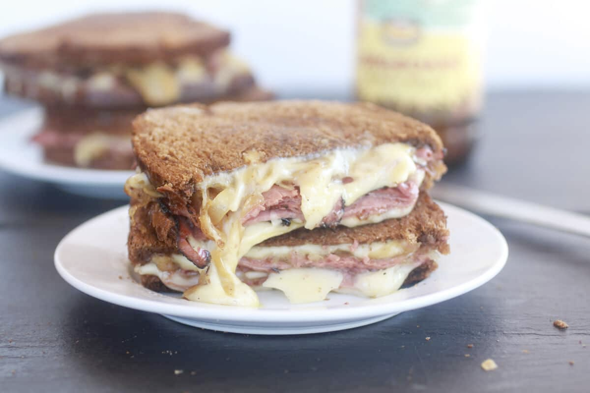

Pastrami and caramelized onion grilled cheese sandwitch

# Pastrami and caramelized onion grilled cheese sandwitch

## Ingredients
 - 1 1/2 tablespoons unsalted butter plus more if needed
 - 1 small onion thinly sliced
 - 1/2 tablespoon sugar
 - Kosher salt and freshly ground pepper
 - 3/4 cup dark beer
 - 2 ounces deli-shaved pastrami or deli-sliced corned beef or leftover corned beef cut into strips
 - 2 teaspoons Worcestershire sauce
 - 1 tablespoon whole-grain mustard
 - 1 1/2 cups grated Jarlsberg cheese about 6 ounces
 - 4 slices pumpernickel or dark rye bread
 - Can add: sauted Mushrooms.

## Instructions

 * Melt 1/2 tablespoon butter in a large skillet over low heat. Add the onion and sprinkle with the sugar, 1/2 teaspoon salt, and pepper to taste. Cook on low heat stirring occasionally, until soft and golden, about 20-25 minutes (to speed the process up you can cover the pan). Add the beer and continue cooking, stirring occasionally until the onions are extremely tender and the liquid is slightly syrupy, about 8 more minutes. Remove from the heat and stir in Worcestershire sauce and mustard. Transfer the onions to a small bowl and set aside.
 * In the same pan add the pastrami and lightly crisp the meat until just warmed through. Remove from the heat and set aside.
 * Lightly butter the outsides of all four pieces of bread. On the inside of the bread, divide half of the cheese between 2 of the bread slices. Top each piece of bread with equal amounts of hot pastrami, and onions. Top with the remaining cheese and then place remaining 2 pieces of bread on top of the cheese (buttered side facing out).
 * Melt the remaining 1 tablespoon butter in a large skillet over medium heat. Add the sandwiches and cook, pressing occasionally with a spatula until the bread is toasted and the cheese melts, about 4 minutes per side, adding more butter to the pan if needed.
 
 Ref: https://www.halfbakedharvest.com/pastrami-and-caramelized-onion-grilled-cheese/#bo-recipe