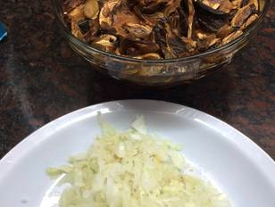
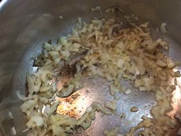
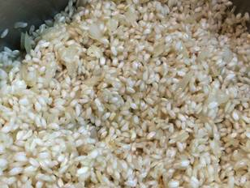
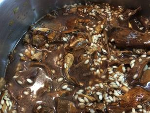
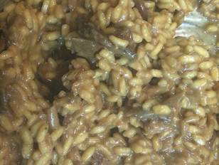

Risotto con funghi

# Risotto con funghi

`Rinde 4 porciones`

## Ingredientes

 * 250 gr arroz arborio (y una yapa)
 * 150 gr funghi porcini secos
 * 1 cebolla chiquita
 * 150 gr parmigiano reggiano
 * 70 gr (al menos) de manteca
 * agua caliente, sal, pimienta.

## Instrucciones 

Comienza colocando los hongos en un recipiente grande y cúbrelos completamente con agua caliente. Déjalos así un buen rato; terminarán de ablandarse cuando los cocines. Pela y pica bien chiquitita la cebolla.

Coloca en una cacerola de fondo grueso 50 gr. de manteca; agrega la cebolla y remueve hasta que quede transparente.

Agrega el arroz (no lo vayas a lavar por favor!) y revuelve para que se perle.

Cuando esté perlado, agrega los hongos con la mitad del agua. La sal y la pimienta (poca, apenas para perfumar) se las pongo durante la cocción. No te olvides de revolver casi ininterrumpidamente. Agrega líquido de a poco, a medida que se vaya consumiendo.

El arroz debe quedar al dente. Unos 20 minutos. Cuando esté, agrégale la mitad del queso rallado y la manteca restante; revuelve bien y sirve de inmediato. El queso y la manteca aclaran el tono amarronado.

Ref: https://cookpad.com/ar/recetas/233853-risotto-con-funghi
