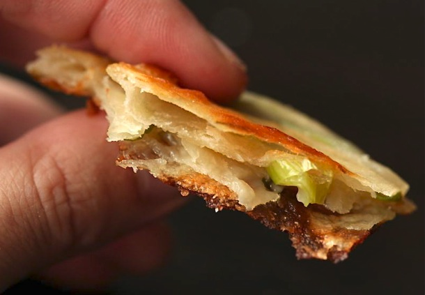

Scallion Pancakes

# Scallion Pancakes

## Ingredients

* 2 cups all-purpose flour, plus extra for dusting work surface
* 1 cup boiling water
* Up to 1/4 cup toasted sesame seed oil
* 2 cups thinly sliced scallion greens

###  Dipping Sauce:
* 2 tablespoons soy sauce
* 2 tablespoons Chinkiang or rice wine vinegar
* 1 tablespoon finely sliced scallion greens
* 1/2 teaspoon grated fresh ginger
* 2 teaspoons sugar

### To Cook:
1/4 cup vegetable oil
Kosher salt

## Instructions

1. Place flour in bowl of food processor (see note). With processor running, slowly drizzle in about 3/4 of boiling water. Process for 15 seconds. If dough does not come together and ride around the blade, drizzle in more water a tablespoon at a time until it just comes together. Transfer to a floured work surface and knead a few times to form a smooth ball. Transfer to a bowl, cover with a damp towel or plastic wrap, and allow to rest for 30 minutes at room temperature, or up to overnight in the fridge.
2. Divide dough into four even pieces and roll each into a smooth ball. Working one ball at a time, roll out into a disk roughly 8-inches in diameter on a lightly floured surface. Using a pastry brush, paint a very thin layer of sesame oil over the top of the disk. Roll disk up like a jelly roll, then twist roll into a tight spiral, tucking the end underneath. Flatten gently with your hand, then re-roll into an 8-inch disk.

3. Paint with another layer or sesame oil, sprinkle with 1/2 cup scallions, and roll up like a jelly roll again. Twist into a spiral, flatten gently, and re-roll into a 7-inch disk. Repeat steps two and three with remaining pancakes.

4. Combine all the sauce ingredients and set aside at room temperature.
5.Heat oil in an 8-inch nonstick or cast-iron over medium-high heat until shimmering and carefully slip pancake into the hot oil. Cook, shaking the pan gently until first side is an even golden brown, about 2 minutes. Carefully flip with a spatula or tongs (be careful not to splash the oil), and continue to cook, shaking pan gently, until second side is even golden brown, about 2 minutes longer. Transfer to a paper towel-lined plate to drain. Season with salt, cut into 6 wedges. Serve immediately with sauce for dipping. Repeat with remaining 3 pancakes.

5 Layers

Ref: https://www.seriouseats.com/recipes/2011/04/extra-flaky-scallion-pancakes-recipe.html