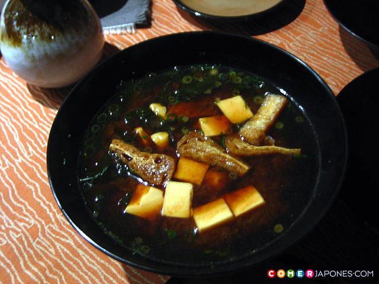

Sopa miso

# Sopa miso

La sopa de miso es un plato fácil de hacer y un básico en la dieta japonesa. En Japón se come con casi todas las comidas que van acompañadas también de arroz. Es tan básico que incluso se toma para desayunar. Reconfortante especialmente en invierno, el autor Junichiro Tanizaki rememora en su libro El elogio de la sombra la sensación de sostener entre sus manos el peso de una sopa de miso contenida dentro de un ligero cuenco de madera mientras observaba cómo el blanquecino caldo de miso emergía enturbiado sobre el oscuro fondo de laca negra del cuenco. Pura poesía para un plato que nos invita a la relajación y contemplación, para reconfortarnos en cuerpo y alma.

Sopa de miso elaborada con miso marrón del restaurante Gion Manzara en Kioto
Y después de esta breve introducción os explicaremos cómo se prepara esta mítica y nutritiva sopa. Para empezar hace falta hacer un caldo dashi (o ichibandashi 一番出汁) que es la base de la sopa, como lo es también de muchos otros platos y aliños de la cocina nipona. Así que, nunca está de más aprender a hacerlo.

El dashi es un caldo claro elaborado con alga kombu o kelp y copos de bonito seco (katsuobushi). En nuestro país estos ingredientes se pueden encontrar únicamente en tiendas especializadas, mientras que en Japón es normal encontrarlos a granel en los mercados. También es posible adquirir caldo dashi instantáneo en polvo (dashinomoto だしの素) que se mezcla con agua, aunque la versión casera siempre sabe mejor.

Por otra parte, el segundo ingrediente clave es el miso, elaborado a base de una pasta de habas de soja hervidas a las que se añade sal y kôji (arroz, trigo o cebada malteados que actúan como un fermento). Según el tipo de kôji empleado el miso será de un tipo u otro: miso blanco, rojo o marrón. Según el área geográfica de Japón, predomina el uso de un tipo de miso u otro, siendo el miso blanco más típico en el norte, el marrón en el centro y el rojo en el sur (a grandes rasgos). Para la sopa de miso se utiliza sobre todo el miso blanco que al contener arroz aporta un sabor más suave y menos salado, aunque las otras variedades también resultan muy sabrosas.

Rinde para 4 personas

## Ingredientes

 * 800 ml de caldo dashi
 * 10 gr de alga wakame disecada
 * 60 ml (unas 4 cucharadas soperas) de pasta de miso blanco
 * 150 gr de tofu blando (preferiblemente fresco)
 * 1-2 cebollas tiernas

Para el dashi
 * 1 l. agua
 * 20 g. alga kombu disecada
 * 20 g. copos de bonito seco (katsuobushi)
 * 1 cacerola
 * 1 colador
 * 1 paño de muselina

## Preparacion Dashi

1. Poner en remojo, durante al menos 2 horas, las tiras de alga kombu en el litro de agua para que se hidraten (no es recomendable sobrepasar las 5 horas en remojo para evitar que el alga libere su viscosidad y sustancias de sabor amargo).
2. Posteriormente se pone el agua con el alga kombu en una cacerola a fuego vivo. Justo antes de que rompa el hervor, cuando se inicie el burbujeo debe retirarse el alga kombu del agua con unas pinzas o palillos de cocina. Dejar que el agua hierva durante 1 minuto más y, acto seguido, apagar el fuego.
3. Añadir los copos de bonito al agua para que infusionen en el agua durante 15 minutos más. Al cabo de este tiempo los copos se habrán hundido al fondo.
4. Forrar el interior de un colador con paño de muselina y colar el caldo en un cuenco. Recoger las esquinas del paño para exprimir con suavidad los copos de bonito que han quedado, de modo que suelten el agua sobrante, pero sin apretar demasiado, dejando que acabe de gotear.

## Preparación sopa de miso
1. Cortar el tofu cuidadosamente en dados de aproximadamente 1 cm.
2. Volver a colocar el caldo resultante en la cacerola, a fuego lento.
3. Verter una parte de caldo dashi en un cuenco aparte y disolver la pasta de miso. Poner suficiente caldo dashi como para que se diluya bien.
4. Paralelamente, añadir al caldo de la cacerola el alga wakame y cocer a fuego lento de 1 a 2 minutos, hasta que se hidrate y se expanda.
5. Una vez disuelto el miso, verter la mezcla nuevamente en la cacerola.
6. Añadir los dados de tofu y seguir calentando durante 1 minuto más.
7. Servir de inmediato en cuencos individuales, aderezando cada ración con finas rodajas de cebolla tierna espolvoreada por encima de la sopa (preferiblemente de la zona verde del tallo).

## Sugerencias

 * Si no dispones de tiempo para preparar el dashi puedes optar por una versión menos ortodoxa y muy simplificada de la sopa de miso en que simplemente disuelves la pasta de miso en agua recién hervida (sin nada) o en caldo dashi instantáneo, añades el alga wakame, los dados de tofu, la cebolleta cortada, y… voilà!
 * Si no dispones de alga wakame pero da la casualidad que tienes alga nori, córtala en pequeñas tiras y espolvoréalo por encima.
 * Para enriquecer aún más tu sopa de miso prueba una versión con setas shiitake y espinacas, con almejas o mejillones al vapor, con brócoli cocido, con un poco de arroz y langostino… Es cuestión de dar rienda suelta a tu imaginación.
